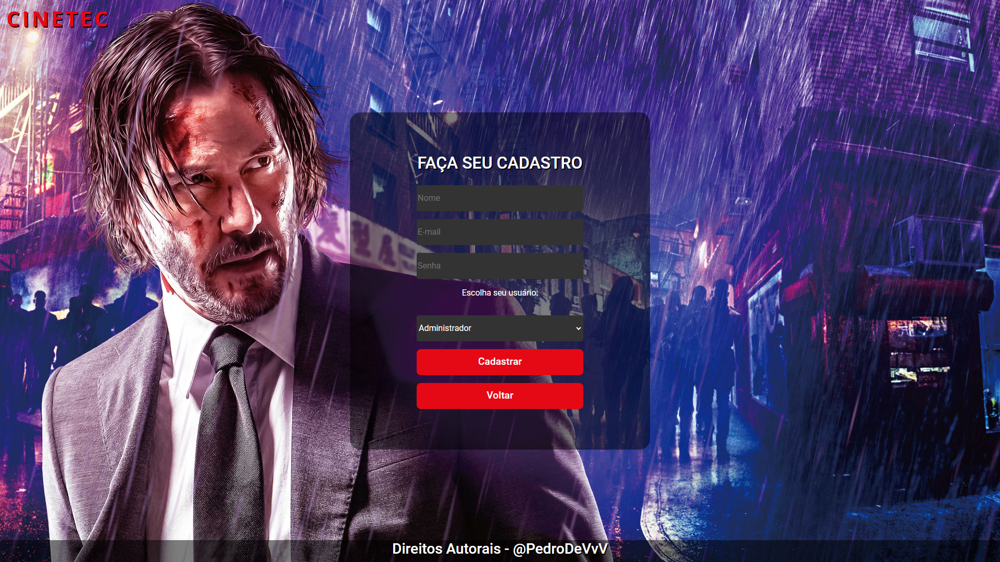
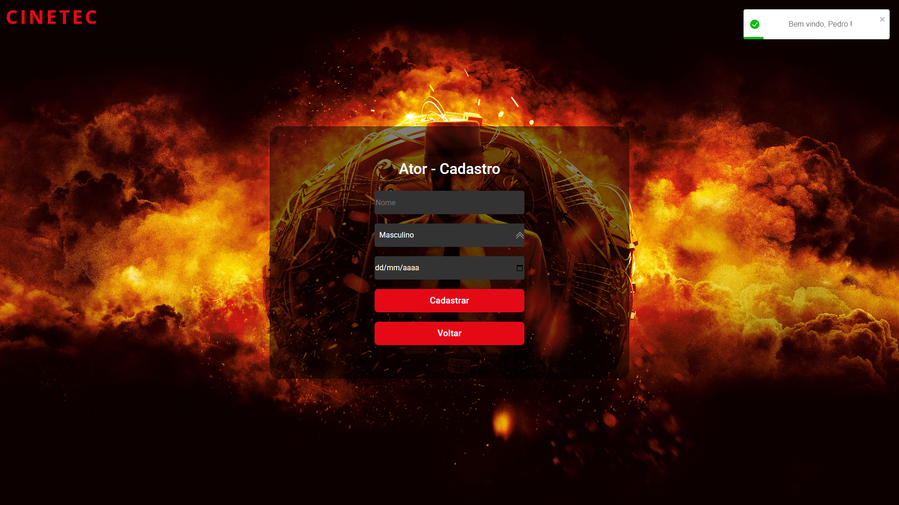
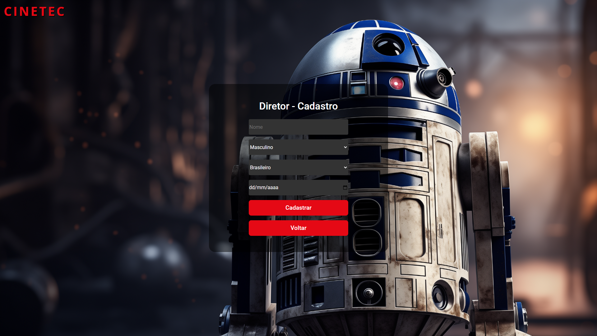
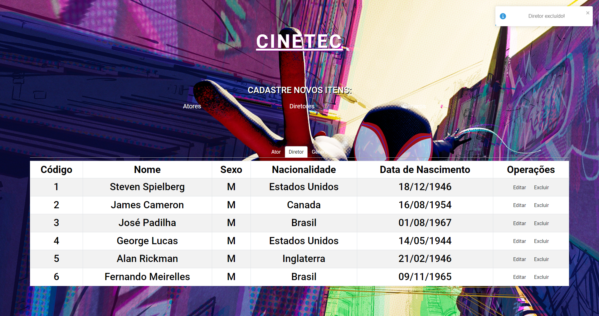

# CINETEC🍿

Um projeto desenvolvido para aprimorar as habilidades em Node.js, React.js e MySQL. Foram utilizadas somente API's de criação própria. Consiste em um tipo de "cinema", onde o usuário pode cadastrar atores, diretores, filmes e gêneros. Um ótimo projeto para treinar a criação de rotas no backend e também estudar o fluxo de uma aplicação por completa.

## Stack utilizada

**Front-end:** React, Bootstrap

**Back-end:** Node.js, Express.js

**Database:** MySQL

## Telas da aplicação

### Login

### Cadastro

### Cadastro de Atores

### Cadastro de Diretores

### Tela principal
